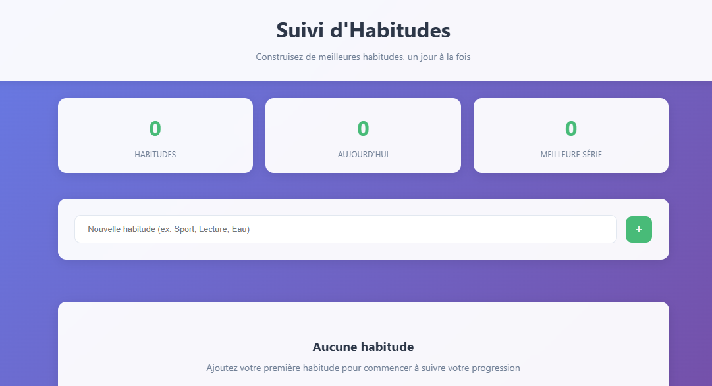

# Habit_Tracking

## Description
Application web permettant de suivre des habitudes quotidiennes et de visualiser la progression (streak, total de jours complétés, etc.).  
Ce projet est le **vingt-quatrième** du défi personnel **100 projets en 2026**.

---

## Objectifs du projet
- Mettre en place un système de suivi journalier
- Manipuler des dates récurrentes
- Calculer des séries (streak)
- Gérer des statistiques simples
- Structurer des données persistantes

---

## Plateforme
- Web (navigateur)

---

## Technologies utilisées
- HTML
- CSS
- JavaScript (Vanilla)
- LocalStorage

---

## Fonctionnalités
- Ajout d’une habitude (ex : Sport, Lecture, Hydratation)
- Validation quotidienne d’une habitude
- Affichage du streak actuel
- Calcul du total de jours complétés
- Suppression d’une habitude
- Sauvegarde automatique en local

---

## Design & UX
- Cartes individuelles pour chaque habitude
- Bouton de validation clair et accessible
- Indicateur de streak mis en évidence
- Interface minimaliste orientée productivité
- Responsive (mobile et desktop)

---

## Captures d’écran

---

## Ce que j’ai appris
- Gestion d’état quotidien
- Manipulation avancée des dates
- Calcul de séries consécutives (streak logic)
- Structuration de données persistantes avec LocalStorage
- Organisation d’un mini-dashboard productivité

---

## Améliorations possibles
- Vue calendrier mensuelle
- Graphique de progression
- Objectif hebdomadaire
- Système de badges
- Mode sombre

---

## Statut du projet
 **Projet terminé**